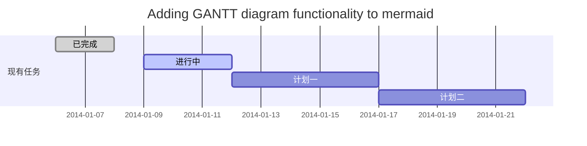
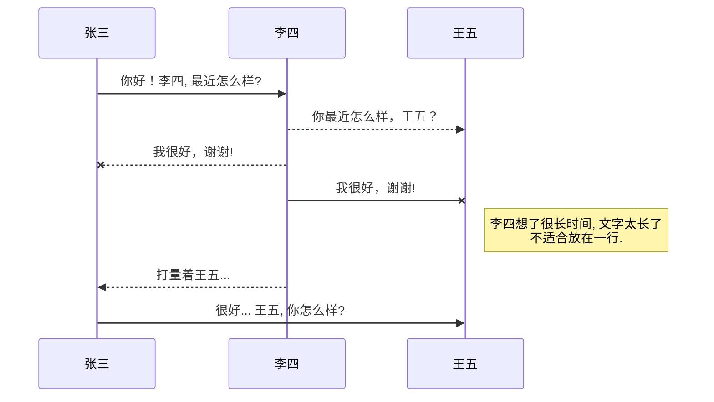
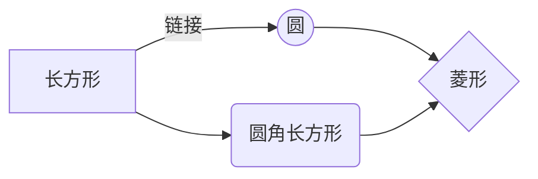

[TOC]

# Tutorial of markdown in Typora

> 工欲善其事，必先利其器

​	如上所说，这里给大家安利一款高BIG的利器Typora，这是一款文艺青年(~~装逼~~)必备的用于编写markdown的打造高质量文档的神器，一打开就有被惊艳到，界面设计使用程序猿最爱的极简风格，清新脱俗，出淤泥而不染(**已经彻底沦陷**)，可以让人集中注意力去构思文档的编写而不用被格式问题所烦扰。支持LaTex公式编辑，Mermaid流程图和甘特图绘制等等。


## 合理的创建标题，有助于目录的生成

* 输入1次<kbd>#</kbd>，并按下<kbd>space</kbd>后再输入文本，将生成1级标题。

* 输入2次<kbd>#</kbd>，并按下<kbd>space</kbd>后在输入文本，将生成2级标题。

以此类推，我们支持6级标题。有助于使用`TOC`语法后生成一个完美的目录，在你想要放置目录的地方码上[TOC]即可生成目录。


## 如何改变文本的样式

```markdown
*强调文本* _强调文本_
```

*强调文本* _强调文本_

```markdown
**加粗文本** __加粗文本__
```

**加粗文本** __加粗文本__

```markdown
==标记文本==
```

==标记文本==

```markdown
~~删除文本~~
```

~~删除文本~~

```markdown
>引用文本
```

> 引用文本

```markdown
H~2~o 是液体
```

H~2~O 是液体。

```markdown
2^10^运算结果是1024
```

2^10^ 运算结果是 1024.


## 生成一个适合你的列表

```markdown
- 项目
  - 项目
    - 项目
```

- 项目
  - 项目
    - 项目

```markdown
1. 项目1
2. 项目2
3. 项目3
```

1. 项目1
2. 项目2
3. 项目3

```markdown
- [ ] 计划任务
```

- [ ] 计划任务

```markdown
- [x] 完成任务
```

- [x] 完成任务


## 如何插入一段漂亮的代码片

* 展示同样高亮的 `代码片`.

```
​```javascript
// An highlighted block
var foo = 'bar';
​```
```

```javascript
// An highlighted block
var foo = 'bar';
```

* 代码折叠

```
<details>
<summary>展开查看</summary>
<pre><code>
​```c++
System.out.println("Hello to see U!");
​```
</code></pre>
</details>
```

<details>
<summary>展开查看</summary>
<pre><code>
```c++
System.out.println("Hello to see U!");
```
</code></pre>
</details>

## 插入链接与图片

### 插入链接

```markdown
链接:[link](https://www.cnblogs.com/coding-fun).
```

链接: [link](https://www.cnblogs.com/coding-fun).

* 插入链接还有一个方便快捷的方式\[link][num],其中num就是数字，例如\[link][1]，然后在文末贴出\[num]到链接的映射如\[1]:https://www.cnblogs.com/coding-fun

```markdown
[link][1]
```

[link][1]

### 插入图片

```markdown
图片: 
```


### 插入带链接的图片

* 还可以给图片加上链接，但是Typera不支持给图片加链接的markdown语法，为知笔记是支持的，也可能是我姿势不对吧，所以在Typora里面我都是用html代码来给图片加链接，下面分别给出这两种方式代码:

```markdown
//markdown
[](https://www.cnblogs.com/coding-fun)
```

```html
//HTML
<div align="center">
 <a href="https://www.cnblogs.com/coding-fun">
 
 </a>
</div>
```

<div align="center">
 <a href="https://www.cnblogs.com/coding-fun">
 
 </a>
</div>

* 除了代码方式外还可以以拖拽方式上传图片。


## 创建一个表格
一个简单的表格是这么创建的：

```markdown
| 项目 | Value |
| ---- | ----- |
| 电脑 | $1600 |
| 手机 | $12   |
| 导管 | $1    |
```

| 项目 | Value |
| ---- | ----- |
| 电脑 | $1600 |
| 手机 | $12   |
| 导管 | $1    |

### 设定内容居中、居左、居右

* 使用`:---------:`居中

* 使用`:----------`居左

* 使用`----------:`居右

```markdown
| 第一列 | 第二列 | 第三列 |
|:-----------:| -------------:|:-------------|
| 第一列文本居中 | 第二列文本居右 | 第三列文本居左 | 
```

|     第一列     |         第二列 | 第三列         |
| :------------: | -------------: | :------------- |
| 第一列文本居中 | 第二列文本居右 | 第三列文本居左 |

### SmartyPants

SmartyPants将ASCII标点字符转换为“智能”印刷标点HTML实体。例如：

```markdown
| TYPE |ASCII |HTML |                      
|----------------|-------------------------------|-----------------------------|
|Single backticks|`'Isn't this fun?'` |'Isn't this fun?' |
|Quotes |`"Isn't this fun?"` |"Isn't this fun?" |
|Dashes |`-- is en-dash, --- is em-dash`|-- is en-dash, --- is em-dash|
```

|    TYPE   |ASCII                          |HTML                         |
|----------------|-------------------------------|-----------------------------|
|Single backticks|`'Isn't this fun?'`            |'Isn't this fun?'            |
|Quotes          |`"Isn't this fun?"`            |"Isn't this fun?"            |
|Dashes          |`-- is en-dash, --- is em-dash`|-- is en-dash, --- is em-dash|


## 如何创建一个注脚

```markdown
一个具有注脚的文本。[^1]
```

* 一个具有注脚的文本。[^1]

```markdown
[^1]: 注脚的解释
```

[^1]: 这是一个注脚解释

* 注脚写在文中但被markdown解析后会放在文末


## KaTeX数学公式

* 可以使用渲染LaTeX数学表达式 [KaTeX](https://khan.github.io/KaTeX/):

  Gamma公式展示 $\Gamma(n) = (n-1)!\quad\forall
  n\in\mathbb N$ 是通过欧拉积分

```latex
$$
\Gamma(z) = \int_0^\infty t^{z-1}e^{-t}dt\,.
$$
```


$$
\Gamma(z) = \int_0^\infty t^{z-1}e^{-t}dt\,.
$$

> 你可以找到更多关于的信息 **LaTeX** 数学表达式[here][1].


## 甘特图绘制

```markdown
​```mermaid
gantt
        dateFormat YYYY-MM-DD
        title Adding GANTT diagram functionality to mermaid
        section 现有任务
        已完成 :done, des1, 2014-01-06,2014-01-08
        进行中 :active, des2, 2014-01-09, 3d
        计划一 : des3, after des2, 5d
        计划二 : des4, after des3, 5d
​```
```


- 关于 **甘特图** 语法，参考 [这儿][2],


## UML 图表绘制

* 可以使用UML图表进行渲染。 [Mermaid](https://mermaidjs.github.io/). 例如下面产生的一个序列图：

```
​```mermaid
sequenceDiagram
张三 ->> 李四: 你好！李四, 最近怎么样?
李四-->>王五: 你最近怎么样，王五？
李四--x 张三: 我很好，谢谢!
李四-x 王五: 我很好，谢谢!
Note right of 王五: 李四想了很长时间, 文字太长了<br/>不适合放在一行.

李四-->>张三: 打量着王五...
张三->>王五: 很好... 王五, 你怎么样?
​```
```



* 这将产生一个流程图:

```
​```mermaid
graph LR
A[长方形] -- 链接 --> B((圆))
A --> C(圆角长方形)
B --> D{菱形}
C --> D
​```
```



- 关于 **Mermaid** 语法，参考 [这儿][3],


## FLowchart流程图绘制

* Typora目前不支持flowchart的渲染，这里仅给出一个示例代码

```flowch
flowchat
st=>start: 开始
e=>end: 结束
op=>operation: 我的操作
cond=>condition: 确认？

st->op->cond
cond(yes)->e
cond(no)->op
```

- 关于 **Flowchart流程图** 语法，参考 [这儿][4].


## 导出与导入

###  导出
当你完成了一篇文章的写作, 在左上方工具栏找到 **文件->导出** ，选择一个你想要的文件格式进行本地保存，支持导出HTML，LaTex，PDF，Word等等。

### 导入
文件导入部分需要下载Pandoc插件用于文件转换，平时写markdown文档没用到导入这个模块，所以也不了解具体的导入细节。

[1]: http://meta.math.stackexchange.com/questions/5020/mathjax-basic-tutorial-and-quick-reference
[2]: https://mermaidjs.github.io/
[3]: https://mermaidjs.github.io/
[4]: http://adrai.github.io/flowchart.js/